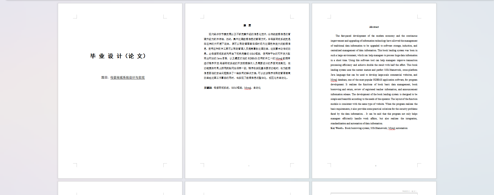
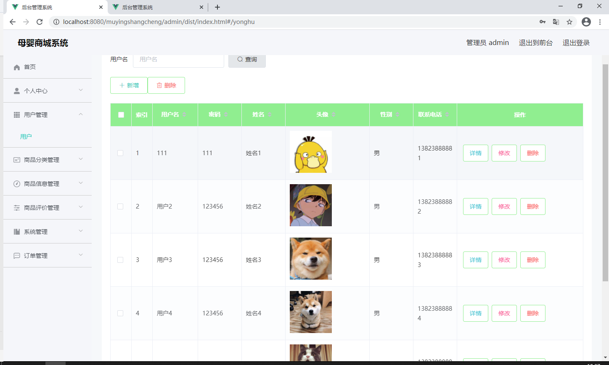
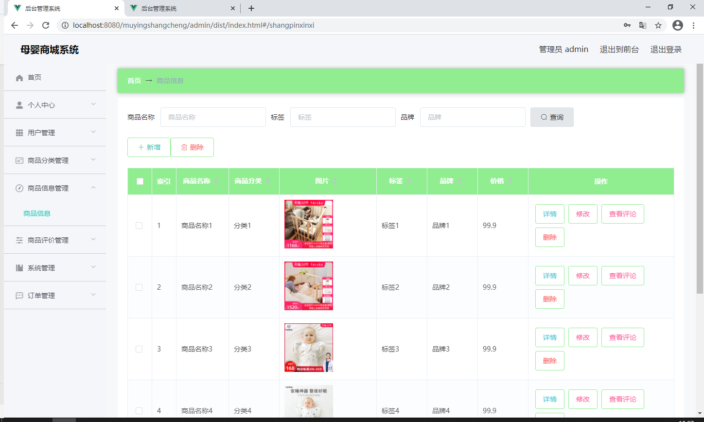

基于Springboot的母婴商城（程序+论文）
=
### 完整代码获取地址：从戎源码网 ([https://armycodes.com/](https://armycodes.com/))
### 作者微信：19941326836  QQ：952045282 
### 承接计算机毕业设计、Java毕业设计、Python毕业设计、深度学习、机器学习
### 选题+开题报告+任务书+程序定制+安装调试+论文+答辩ppt 一条龙服务
### 所有选题地址https://github.com/nature924/allProject

一、项目介绍
---
系统包含两种角色：用户、管理员，系统分为前台和后台两大模块，主要功能如下：

### 1 用户信息管理
用户信息管理页面提供以下功能给管理员：

用户信息查询管理：可以查询用户信息。
用户信息操作：支持删除、修改和新增用户信息。
模糊查询：支持对用户名称进行模糊查询以便于快速定位用户信息。
### 2 商品分类管理
商品分类管理页面提供以下功能给管理员：

查看商品分类：能够查看已发布的商品分类数据。
商品分类操作：支持对商品分类进行修改和作废操作，作废的分类可以被删除。
### 3 商品信息管理
商品信息管理页面提供以下功能给管理员：

商品信息查询：能够根据商品名称进行条件查询。
商品数据操作：支持对商品数据进行新增、修改和查询等操作。
### 4 商品资讯管理
商品资讯管理页面提供以下功能给管理员：

查看商品资讯：能够查看已发布的商品资讯数据。
商品资讯操作：支持修改和作废商品资讯，作废的资讯可以被删除。

二、项目技术
---
- 编程语言：Java
- 数据库：MySQL
- 项目管理工具：Maven
- 前端技术：VUE、HTML、Jquery、Bootstrap
- 后端技术：Spring、SpringMVC、MyBatis

三、运行环境
---
- 操作系统：Windows、macOS都可以
- JDK版本：JDK1.8以上都可以
- 开发工具：IDEA、Ecplise、Myecplise都可以
- 数据库: MySQL5.7以上都可以
- Tomcat：任意版本都可以
- Maven：任意版本都可以

四、运行截图
---
### 论文截图：

### 程序截图：

